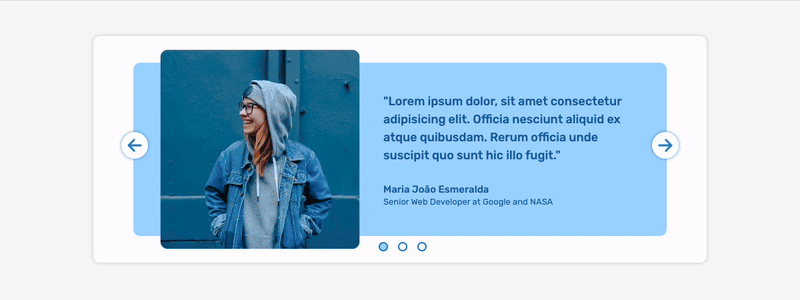

# Interactive Carousel

## Project Overview

This project features a simple, yet interactive carousel component designed using HTML, CSS, and JavaScript. Aimed for educational purposes, this component showcases responsive design techniques and ensures compatibility across various device widths using max-width properties. The carousel holds three slides, each representing different content and layout structures.



The project is live at: [https://ionstici.dev/interactive-carousel/](https://ionstici.dev/interactive-carousel/)

## Features

- **Pure HTML, CSS, and JavaScript:** No external libraries or frameworks were used, ensuring a lightweight and easily understandable codebase.
- **Responsive Design:** Utilizes max-width for adapting to various screen sizes, enhancing user experience on both mobile and desktop devices.
- **Interactive Slides:** Allows users to navigate through different slides with user-friendly arrow controls.

## Getting Started

To get a local copy up and running, follow these simple steps:

```bash
# Clone the repo to your local machine using:
git clone https://github.com/ionStici/interactive-carousel.git

# navigate to the project directory
cd interactive-carousel

# Install NPM packages
npm install

# Run Vite for local development
npm run dev

# Prepare the code for production
npm run build
```

## Technologies Used

- `Vite` for building and serving the code efficiently.
- `ESLint` for ensuring code quality.
- `gh-pages` for seamless hosting on GitHub Pages.

## Usage

Integrate this carousel into your project or use it as a stand-alone feature on your educational web pages. Feel free to explore the structure and styles to adapt it further to your needs.

## Contributing

Contributions are what make the open-source community such an amazing place to learn, inspire, and create. Any contributions you make are greatly appreciated. Please refer to [CONTRIBUTING.md](./CONTRIBUTING.md) for guidelines on how to proceed.

## License

Distributed under the MIT License. See [LICENSE](./LICENSE) file for more information.

## Contact

- [ionStici | GitHub](https://github.com/ionStici)
- [Ion Stici | LinkedIn](https://www.linkedin.com/in/ionstici/)

Feel free to reach out if you have any questions or suggestions!
